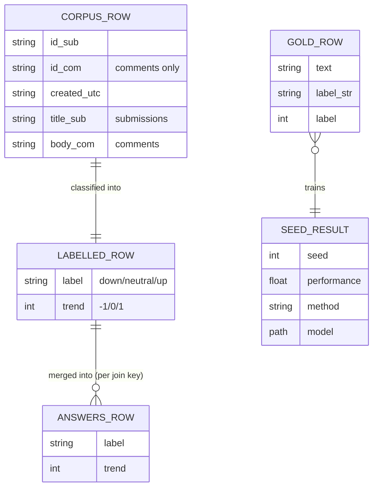

# Data Model

## Entity-relationship overview



## The label set (`reddit.core.config.LabelsConfig`)

The single authority for the three-way **directional inflation-expectation
label** — UP/DOWN/NEUTRAL, not a generic sentiment score:

```yaml
labels:
  labels:      {down: 0, neutral: 1, up: 2}    # classification-head ids
  encodings:   {down: -1, neutral: 0, up: 1}   # signed trend value
```

**Invariant** (enforced by a pydantic `model_validator`): `labels.labels`
ids must be contiguous starting at `0`; `labels.encodings` must declare
exactly the same names as `labels.labels`. Both training (`DataBundle`'s
`ClassLabel` cast) and inference (`CorpusJob.label_col`/`trend_col`
decoding) read from this single object — see [ADR
0001](../architecture_decision_records/0001-qdora-plus-xqdora-plus-peft-recipe.md)
context and the `LabelsConfig` docstring for why this replaced two
independently-derived mappings.

## Gold dataset (`data/labelled.xlsx`)

Consumed by `reddit.data.preparation.load_and_prepare_data`. Required
columns: `config.dataset.text_column` (submission text) and
`config.dataset.label_column` (case-insensitive label string, lower-cased
before mapping through `labels.label2id`). Rows with a null text or label
are dropped. An undeclared label value raises
`reddit.core.errors.UndeclaredLabelError`. Output: a
`reddit.data.preparation.DataBundle` — stratified `train`/`validation`/`test`
`Dataset`s plus the resolved `num_labels`/`id2label`/`label2id`.

**Not modelled here:** how `labelled.xlsx` itself was constructed (manual
annotation, zero-shot LLaMA-70B, fine-tuned LLaMA-8B, ChatGPT-assisted
adjudication, per the paper) — that process is external to this
repository.

## Corpus CSVs (`{reddit_dir}/{subreddit}_final_jae.csv` / `_comments_final_jae.csv`)

Read by `reddit.inference.corpus.predict_corpus`, one file per subreddit in
`reddit.inference.corpus.SUBREDDITS` (`economy`, `economics`,
`wallstreetbets`). Required columns per `CorpusJob`: the text column
(`title_sub` for submissions, `body_com` for comments) plus the join keys
in `CorpusJob.cols` — `("created_utc", "id_sub")` for submissions;
`("created_utc_com", "id_sub", "id_com")` (LLM path) or
`("created_utc_sub", "created_utc_com", "id_sub", "id_com")` (BERT path,
one extra key — a deliberate, preserved divergence) for comments. Rows
with a null text value are dropped before batching.

**Not modelled here:** these CSVs are assumed already keyword-filtered,
geo-classified and (comments) timeliness-restricted — see [System
Overview: Scope boundary](system_overview.md#scope-boundary).

## Labelled output and answers files

Each `predict_corpus` run writes:

1. A **standalone labelled CSV** under `labels_dir`
   (`CorpusJob.output_filename`) — the join-key columns plus the new
   `label_col`/`trend_col` (and the text column, if `CorpusJob.keep_text`).
2. A merge into the **consolidated answers CSV** under `results_dir`
   (`CorpusJob.answer_file`, e.g. `all_final_jae.csv`), via
   `reddit.inference.corpus.update_answers`: a left merge on
   `CorpusJob.cols`, `validate="many_to_one"` (duplicate join keys in the
   freshly labelled frame raise rather than silently multiplying answers
   rows), written atomically (temp file + `os.replace`). LLM results merge
   into a **per-family copy** of the answers file
   (`{stem}_{family}{ext}`); BERT results update the shared file **in
   place** — see `CorpusJob.family_suffix`.

## Run artefacts

- **Checkpoints**: `models/{model}_{method}_{seed}` (LLM, zipped to
  `.zip` after selection) or `models/{model}_{seed}` (BERT).
- **Training metrics**: `outputs/{family}_{date}/dist_{model}_{train,test}_metrics.jsonl`
  (one record per seed, from `reddit.training.loop.run_seeds`) and
  `dumps/{model}[_{method}]_training_logs.jsonl` (one record per eval
  logging step, from `reddit.modeling.trainer.LogMetricsCallback`).
- **Selection record**: `results/selected_models_metrics.jsonl` (one
  record per (model, method) selection, from
  `reddit.training.selection.select_median`).

## See also

- [Interfaces](interfaces.md) for the schema's Python-level types.
- [Downstreams](../operations/downstreams.md) for how the answers CSVs are
  consumed outside this package.
