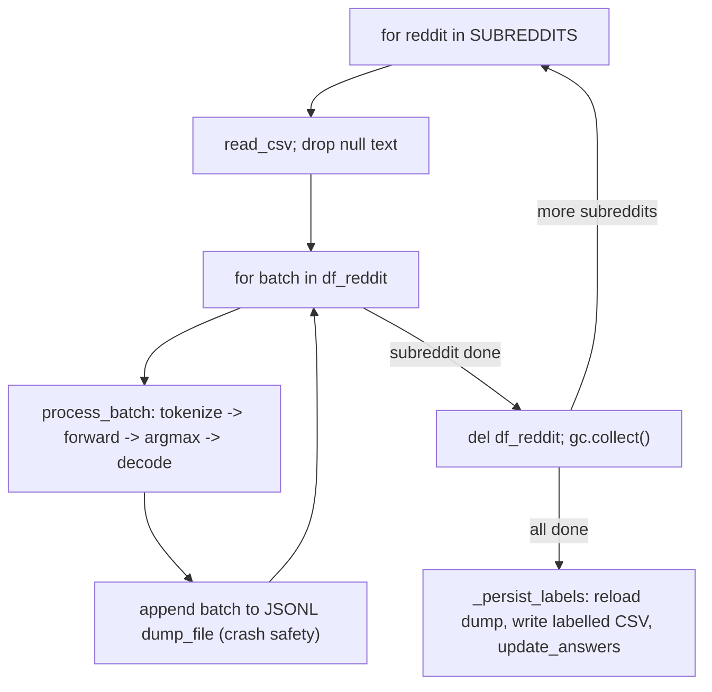

# Runtime Behavior

## Process model

`reddit` is a single-process, single-GPU-context-at-a-time CLI invocation
— there is no daemon, no server, and (in this package's own code) no
worker-pool concurrency: the pipelines do not spawn subprocesses (the only
child processes are the `DataLoader` workers `transformers.Trainer` forks,
which never touch CUDA). Parallelism across GPUs is achieved externally,
by launching one `reddit` process per GPU against a disjoint `--model`
subset (see `config.yml`).

## Multi-seed training lifecycle

`reddit.training.loop.run_seeds` is the shared lifecycle for both kinds.
The seeds in `training.seeds` are *split* seeds: each one draws a
different stratified train/validation/test partition of the gold dataset,
and that partition is the only thing that varies between runs. Model
initialisation (PEFT adapters, the classification head) is re-seeded from
the fixed `training.arguments.seed` right before the model is built, and
`transformers.Trainer` re-seeds itself from the same value for its
shuffling and dropout, so seed-to-seed variance measures sensitivity to
the split, not optimiser noise.

```mermaid
sequenceDiagram
    participant Loop as run_seeds
    participant Data as load_and_prepare_data
    participant Strat as SeedStrategy
    participant Trainer as WeightedLossTrainer

    loop for each seed
        Loop->>Loop: set_seed(seed)
        Loop->>Data: load_and_prepare_data(..., random_seed=seed)
        Data-->>Loop: DataBundle (re-split per seed)
        Loop->>Strat: build_model(ctx, bundle)
        Strat-->>Loop: (model, model_conf)
        Loop->>Strat: tokenize / data_collator / training_arguments / optimizers
        Loop->>Trainer: construct(model, args, class_weights, optimizers, callbacks)
        Trainer->>Trainer: train() / evaluate() / predict(test)
        Trainer-->>Loop: metrics
        Loop->>Loop: append train/test metrics JSONL
        Loop->>Loop: save checkpoint; empty_cache(); gc.collect()
    end
```

A failure on one seed (any exception during model build, tokenization, or
training) is caught, logged (`logging.critical` + the per-run `log`), and
the loop proceeds to the next seed — one bad seed cannot abort the whole
family run. `finally: torch.cuda.empty_cache(); gc.collect()` runs after
every seed regardless of outcome.

## Median-seed selection

`reddit.training.selection.select_median` ranks completed seeds by test
`f1_weighted` (seeds with a non-finite score are excluded from ranking,
not treated as zero), keeps the upper-median seed
(`ranked[len(ranked) // 2]`, matching the previous `statistics.median_high`
semantics), and deletes every other seed's checkpoint directory
(`shutil.rmtree`) — a deliberate, irreversible cleanup to bound disk usage
across a multi-model, multi-method, multi-seed sweep.

## Corpus-labelling lifecycle

`reddit.inference.corpus.predict_corpus` streams one subreddit at a time
(only one subreddit's frame is ever in memory) and, within a subreddit,
one batch at a time:



Both per-subreddit failures (missing/malformed CSV) and per-batch failures
are caught and logged without aborting the run — one absent file or one
bad batch degrades the run instead of failing it outright. The JSONL dump
is truncated to empty at the start of every `predict_corpus` call
(appending to a stale dump would duplicate join keys downstream in the
merge).

## GPU memory management

Both lifecycles call `torch.cuda.empty_cache()`/`gc.collect()` at natural
boundaries (per seed, per checkpoint, after each subreddit's frame is
freed) — a deliberate discipline given multi-model sweeps run many
multi-billion-parameter checkpoints through the same process without
restarting it.

## See also

- [Operations: Workflows](../operations/workflows.md) for the full
  call-chain from CLI entry point down to these lifecycles.
- [Observability](observability.md) for what each stage logs/persists.
