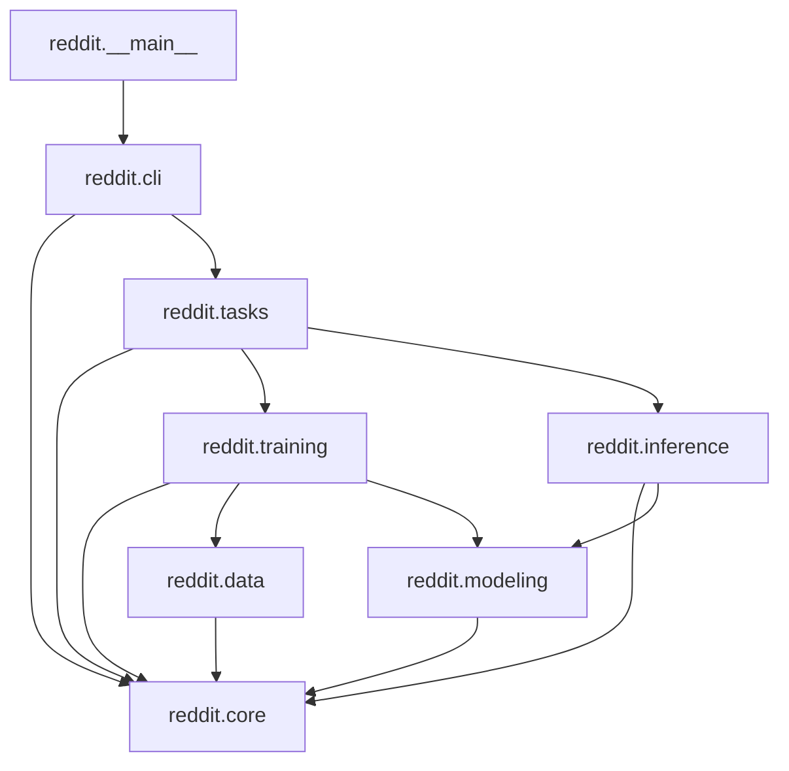

# System Overview

## Bounded contexts

`tach.toml` declares the authoritative layering (verified in CI by
`uv run tach check`):

`reddit.core` is the foundation (config schema, errors, logging,
environment bootstrap, shared protocols/utilities) and depends on nothing
internal. `reddit.training` and `reddit.inference` never import each
other — their only meeting point is `reddit.tasks`, which is deliberately
the *only* module allowed to see both (see [ADR
0004](../architecture_decision_records/0004-training-inference-boundary-via-tasks.md)).
This keeps the training stack importable (e.g. for unit tests, or a
future batch-training-only deployment) without pulling in the
corpus-labelling machinery, and vice versa.

## Scope boundary

See [Implementation Design →
Introduction](index.md#scope-boundary) for the full stage-by-stage table
of what this package implements versus what belongs to the paper's wider
pipeline. In one sentence: **`src/reddit` starts from an already-filtered
per-subreddit corpus and an already-labelled gold dataset, and ends at
per-row directional labels merged into a consolidated answers CSV** — it
neither constructs its inputs nor aggregates its outputs into the paper's
time-series indicators.

## Two independent execution paths, one shared spine

Both the decoder-LLM path (`reddit.training.llms` /
`reddit.inference.llms`) and the BERT-family path (`reddit.training.bert`
/ `reddit.inference.bert`) share:

- the same multi-seed training loop (`reddit.training.loop.run_seeds`),
  parameterized by a `reddit.training.loop.SeedStrategy` implementation;
- the same median-seed selection (`reddit.training.selection.select_median`);
- the same corpus-labelling machinery
  (`reddit.inference.corpus.predict_corpus`/`update_answers`), parameterized
  by a `reddit.inference.corpus.CorpusJob`;
- the same weighted-loss `Trainer` subclass
  (`reddit.modeling.trainer.WeightedLossTrainer`) and metrics function
  (`reddit.modeling.metrics.compute_metrics`).

What differs between the two paths — quantization, PEFT adapters, the
LoRA+ optimizer, tokenizer padding side, truncation length, answers-file
merge strategy — is isolated behind these two extension points
(`SeedStrategy`, `CorpusJob`), not duplicated across the codebase. See
[Components](components.md) for the per-module contracts and [ADR
0003](../architecture_decision_records/0003-shared-seed-loop-strategy-pattern.md)
for why this shape was chosen.

## External systems

- **Hugging Face Hub** — model/tokenizer downloads (`transformers`,
  `huggingface-hub`), gated by an optional HF token (see
  [Security](security.md)).
- **CUDA** — every production code path assumes a GPU; `bitsandbytes`
  4-bit quantization and `flash-attn` are both CUDA-only.
- **Local filesystem** — the gold dataset, per-subreddit corpus CSVs, and
  every run artefact (checkpoints, JSONL dumps, CSV answers files, logs)
  are plain files under the directories declared in `config.yml`
  (`paths:`), typically an Azure ML mounted share in this project's actual
  deployment (see [Deployment](deployment.md)).
