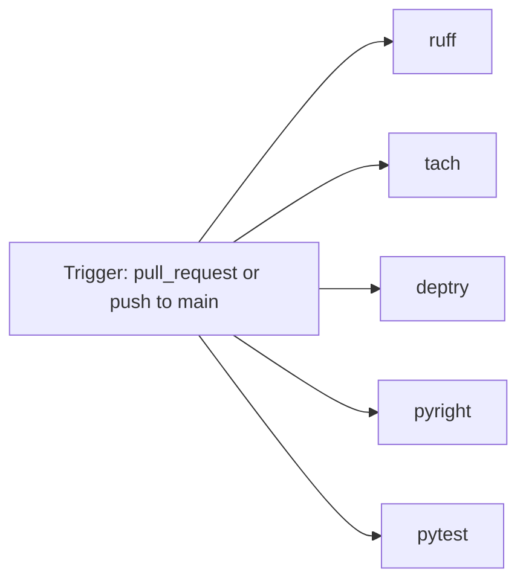

# CI/CD

## Pipeline

`.github/workflows/dependency-architecture-checks.yml` ("Quality Checks")
runs on every pull request and on every push to `main`
(`concurrency.cancel-in-progress: true` per ref, so superseded runs on the
same branch are cancelled automatically). Five independent jobs, all on
`ubuntu-latest`, each setting up `uv` with caching enabled:

| Job | Dependency install | Command |
|---|---|---|
| `ruff` | `uv sync --only-group lint --no-install-project` | `ruff check src/ tests/` |
| `tach` | `uv sync --only-group lint --no-install-project` | `tach check` |
| `deptry` | `uv sync --only-group lint --no-install-project` | `deptry src` |
| `pyright` | `uv sync --group lint` (full project, strict mode needs real imports) | `pyright` |
| `pytest` | `uv sync --group test` (full project, so heavy sub-suites collect) | `pytest tests/ -q` |

`ruff`/`tach`/`deptry` install only the lint tools (`--no-install-project`,
skipping the heavy `torch`/`transformers` runtime set) since none of the
three need to import the package; `pyright` and `pytest` install the full
project because strict type-checking and the heavy test sub-suites both
need real imports to resolve against (`pytest`'s heavy sub-suites exercise
the real modules through fakes, never GPUs or network downloads, per the
workflow's own inline comments).

## What is *not* automated

There is no automated release/publish job, no container build, and no
deployment step — `reddit` has no distributed artefact beyond the editable
source install (see [Implementation Design:
Deployment](../implementation_design/deployment.md)). `CHANGELOG.md` is
maintained by hand (see [Contributing](../../contributing.md)); there is no
`docs`-build job wired into CI at the time of writing, so
`uv run mkdocs build --strict` must currently be run locally before
publishing documentation changes.

## Local equivalent

Every job above is runnable locally with the same command it runs in CI
(see [Contributing](../../contributing.md#quality-gates)); this is
deliberate, so a contributor never has to guess what CI will report before
pushing.

## See also

- [Implementation Design: Security](../implementation_design/security.md#dependency-hygiene)
  for why `deptry`/`tach` run as part of this gate.
