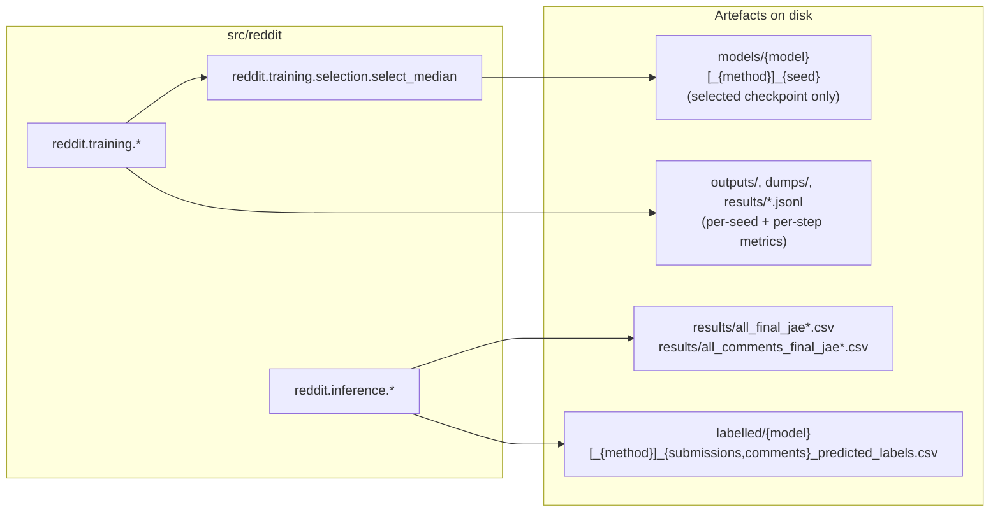

# Downstreams

Everything this package feeds **out to**, and — critically — what it does
not feed into within this repository.

## What this package produces

- **Selected checkpoints** (`models/`) — one per (model, method) that
  produced a usable score; consumed by `reddit predict` or by a future
  training run's own inference step.
- **Metrics JSONL** (`outputs/`, `dumps/`, `results/selected_models_metrics.jsonl`)
  — see [Implementation Design:
  Observability](../implementation_design/observability.md); consumed by a
  human/analysis script reading the files directly, not by any code in
  this repository.
- **Labelled CSVs** (`labelled/`) — one standalone file per (model,
  method, submissions|comments), with the label/trend columns and the join
  keys (plus text, for the BERT path).
- **Consolidated answers CSVs** (`results/all_final_jae*.csv`,
  `results/all_comments_final_jae*.csv`) — every model's label/trend
  columns merged side-by-side on the shared join keys, via
  `reddit.inference.corpus.update_answers`. This is the package's terminal
  artefact: a per-row directional label for every submission/comment in
  the corpus, per model.

## What this package does *not* do with its own output

Per the paper's described methodology (brief for this documentation
effort), the answers CSVs above are themselves an *input* to further
processing this package does not implement:

1. **Signal construction** — per submission/day, summing `(UP − DOWN)`
   trend values across qualifying submissions (NEUTRAL contributes `0`;
   zero on days with no qualifying submissions); at the thread level,
   equally weighting a submission's own signal with its filtered, timely
   comments' signals, then re-mapping to a discrete label via a threshold
   around `0`.
2. **Backward-looking moving-average aggregation** — strictly
   backward-looking (never centered/forward-looking, to avoid look-ahead
   bias) moving averages at window lengths of 1, 5, 10, 30, 60, 90, 180 and
   360 days, producing a grid of 3 subreddits × 12 model variants × 8 MA
   windows = 288 candidate daily indicators.
3. **Inflation nowcasting/forecasting** — pseudo-real-time recursive-window
   regressions of US CPI/PCE inflation against the resulting indicators.

None of steps 1–3 exist in `src/reddit`. Do not assume the answers CSVs
this package produces are, by themselves, the paper's reported inflation
indicators — they are the per-row classification input to that
construction, not its output.

## See also

- [Implementation Design: Data
  Model](../implementation_design/data_model.md#labelled-output-and-answers-files)
  for the exact answers-CSV schema and merge semantics.
