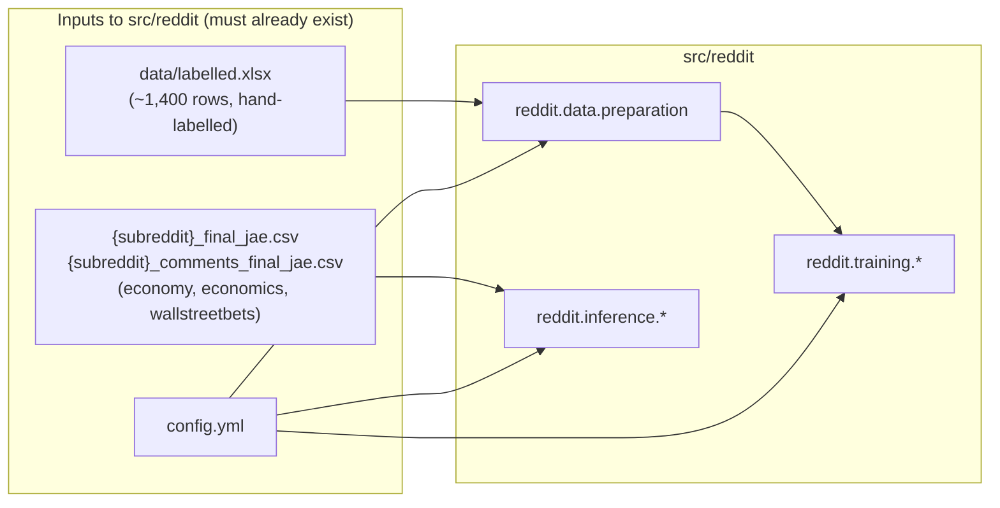

# Upstreams

Everything feeding **into** the pipeline, and — critically — what feeds
into the paper's wider pipeline but not into this package.

## What this package consumes

- **`data/labelled.xlsx`** — the fine-tuning ground truth, loaded by
  `reddit.data.preparation.load_and_prepare_data`. Schema: a text column
  and a label column (names configurable via `config.dataset.text_column`/
  `label_column`), label values matching `config.labels.labels`
  case-insensitively.
- **`{subreddit}_final_jae.csv` / `{subreddit}_comments_final_jae.csv`**
  — the per-subreddit corpus, one pair of files per entry in
  `reddit.inference.corpus.SUBREDDITS` (`economy`, `economics`,
  `wallstreetbets`), read by `reddit.inference.corpus.predict_corpus`.
  Required columns: the text column (`title_sub`/`body_com`) and the join
  keys in `CorpusJob.cols` — see [Implementation Design: Data
  Model](../implementation_design/data_model.md).
- **`config.yml`** — every path, hyperparameter and model-family
  declaration; see [Configuring a Run](../../how_to/configuring-a-run.md).

## What this package does *not* acquire or filter

Per the paper's described methodology (brief for this documentation
effort), the corpus CSVs above are themselves the *output* of an upstream
pipeline this package does not implement:

1. **Corpus acquisition** — Pushshift snapshots (through ~early 2024)
   merged with the Reddit API (PRAW, mid-2024 onward) into one timestamped
   database, covering r/Economics from 2008-01, r/economy from 2008-03,
   r/wallstreetbets from 2012-04, through 2025-08.
2. **Keyword-lexicon filter** — retaining only submissions/comments
   matching an inflation-related lexicon (`inflation`, `deflation`,
   `disinflation`, `hyperinflation`, `price`, `prices`; for
   r/wallstreetbets, `price`/`prices` are excluded since they usually refer
   to asset prices there, not consumer prices).
3. **Geographic classification** — an unfine-tuned, zero-shot LLaMA-70B
   classification of each submission title into US-related /
   non-US-related / no-clear-reference, retaining US and unclear, dropping
   explicit non-US.
4. **Comment timeliness filter** — retaining only comments posted within
   two weeks of their parent submission.

None of steps 1–4 are implemented in `src/reddit`; per the initial project
brief they may live in `legacy/src/data_processing.py` and/or
`notebooks/reddit_agentic_filtering.ipynb`, neither of which is part of
this package and neither of which was audited as part of this
documentation effort.

## See also

- [Implementation Design: System
  Overview](../implementation_design/system_overview.md#scope-boundary)
  for the full scope-boundary table.
- [Preparing the Gold Dataset](../../how_to/preparing-the-gold-dataset.md)
  and [Labelling the Corpus](../../how_to/labelling-the-corpus.md) for
  task-oriented usage of these inputs.
