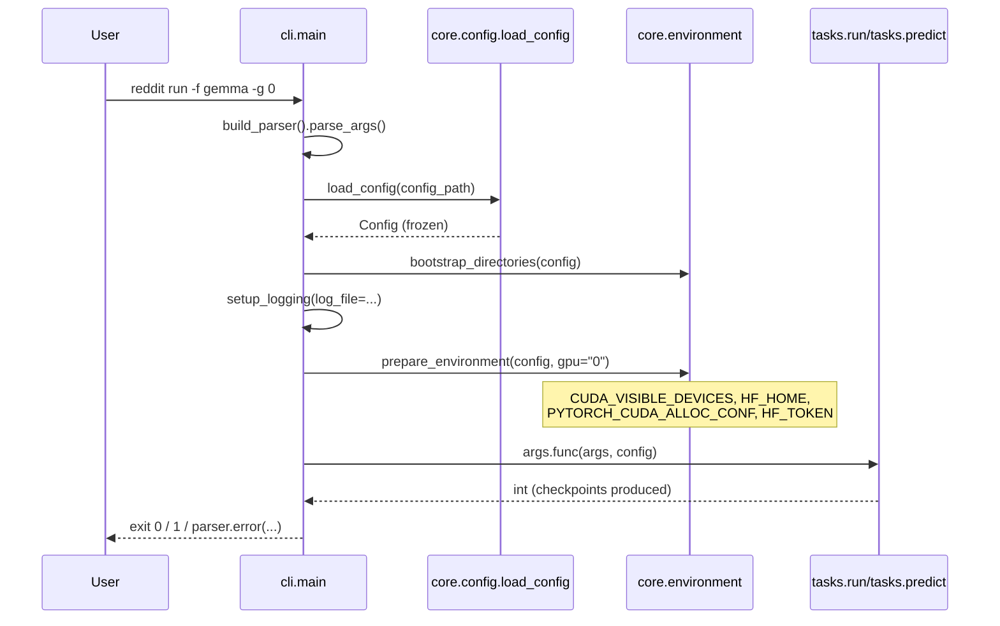
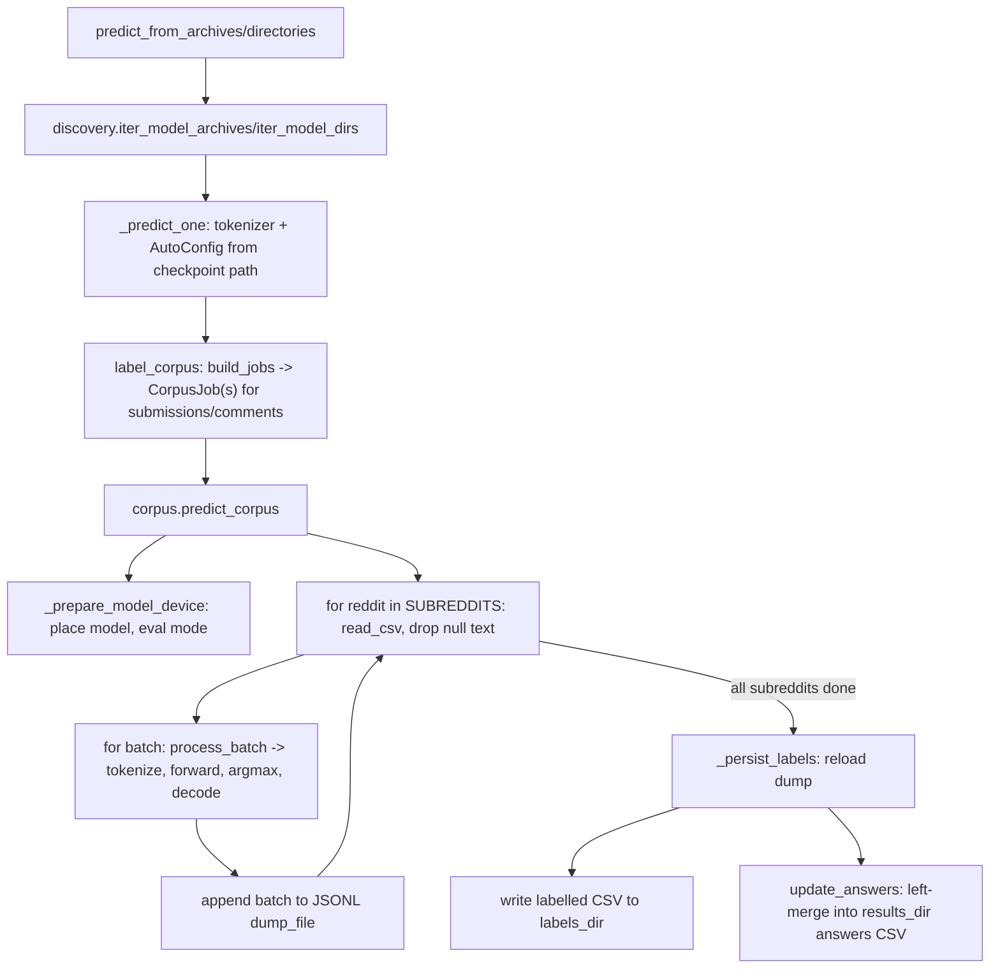

# Workflows

Detailed, code-level walkthroughs of every public entry point exposed by
`reddit`, starting from the CLI and tracing the call chain downward. Every
method/function named below links to its API reference entry.

## CLI dispatch

**Entry point:** :func:`reddit.cli.main` — see [Using the
CLI](../../how_to/using-the-cli.md) for the high-level counterpart.



`ConfigError` (including `UnknownFamilyError`, `UnsupportedMethodError`,
`UndeclaredLabelError`) is caught around `args.func(...)` and turned into
`parser.error(...)`; any other `RedditError` is logged with a traceback and
returns exit code `1`. See [Implementation Design:
Observability](../implementation_design/observability.md#error-visibility).

## Training: decoder LLMs {: #training-llms }

**Entry point:** :func:`reddit.tasks.run.execute_run` (`models.kind ==
"llm"`, the default) → :func:`reddit.training.llms.run_family` — see
[Fine-Tuning Decoder LLMs](../../how_to/fine-tuning-decoder-llms.md) for
the high-level counterpart.

```mermaid
sequenceDiagram
    participant Task as tasks.run.execute_run
    participant Fam as training.llms.run_family
    participant Mod as training.llms.run_model
    participant Loop as training.loop.run_seeds
    participant Strat as training.llms.LlmSeedStrategy
    participant Sel as training.selection.select_median
    participant Lab as inference.llms.label_corpus

    Task->>Fam: run_family(config, models, labeller=label_corpus, limit)
    Fam->>Fam: validate methods against modeling.peft.peft_config
    loop for (model, method) in product(models.models, methods)
        Fam->>Mod: run_model(config, models, model, method, log, seeds)
        Mod->>Mod: AutoTokenizer.from_pretrained(...)
        Mod->>Loop: run_seeds(ctx, LlmSeedStrategy())
        loop for seed in ctx.seeds
            Loop->>Strat: build_model -> 4-bit load + get_peft_model(QDoRA+/xQDoRA+)
            Loop->>Strat: tokenize / data_collator / training_arguments
            Loop->>Strat: optimizers -> create_loraplus_optimizer(ratio=5)
            Loop->>Loop: WeightedLossTrainer.train/evaluate/predict
            Loop->>Loop: append train/test metrics JSONL
        end
        Mod->>Sel: select_median(config, model.name, results, method, log)
        Sel-->>Mod: (median_model, median_conf) | (None, None)
        Mod->>Lab: label_corpus(config, family, model.name, median_model, ...)
        Lab-->>Mod: (writes labelled CSVs + updates answers)
        Mod->>Mod: archive_model(median_model); rmtree(cache_dir)
    end
    Fam->>Fam: clear_hf_cache once every method for a model has run
```

Relevant symbols: :class:`reddit.training.llms.LlmSeedStrategy`,
:meth:`reddit.training.llms.LlmSeedStrategy.build_model`,
:meth:`reddit.training.llms.LlmSeedStrategy.optimizers`,
:func:`reddit.training.loop.run_seeds`,
:func:`reddit.training.selection.select_median`,
:data:`reddit.modeling.peft.peft_config`.

## Training: BERT encoders {: #training-bert }

**Entry point:** :func:`reddit.tasks.run.execute_run` (`models.kind ==
"bert"`) → :func:`reddit.training.bert.run_family` — see
[Fine-Tuning BERT Encoders](../../how_to/fine-tuning-bert-encoders.md) for
the high-level counterpart.

```mermaid
sequenceDiagram
    participant Task as tasks.run.execute_run
    participant Fam as training.bert.run_family
    participant Mod as training.bert.train_model
    participant Loop as training.loop.run_seeds
    participant Strat as training.bert.BertSeedStrategy
    participant Sel as training.selection.select_median
    participant Lab as inference.bert.label_corpus

    Task->>Fam: run_family(config, models, labeller=label_corpus, limit)
    loop for model in models.models
        Fam->>Mod: train_model(config, models, model, log, seeds)
        Mod->>Mod: AutoTokenizer.from_pretrained(...)
        Mod->>Loop: run_seeds(ctx, BertSeedStrategy())
        loop for seed in ctx.seeds
            Loop->>Strat: build_model -> full-precision (bf16) load, no PEFT
            Loop->>Strat: optimizers -> (None, None): Trainer default AdamW
            Loop->>Loop: WeightedLossTrainer.train/evaluate/predict
            Loop->>Loop: append train/test metrics JSONL
        end
        Mod->>Sel: select_median(config, model.name, results, "-", log)
        Sel-->>Mod: (median_model, median_conf) | (None, None)
        Mod->>Lab: label_corpus(config, family, model.name, median_model, ...)
        Lab-->>Mod: (writes labelled CSVs + updates answers in place)
        Mod->>Mod: rmtree(cache_dir); rmtree(hf_cache)
    end
```

Relevant symbols: :class:`reddit.training.bert.BertSeedStrategy`,
:meth:`reddit.training.bert.BertSeedStrategy.build_model`,
:meth:`reddit.training.bert.BertSeedStrategy.optimizers`,
:func:`reddit.training.loop.run_seeds`.

## Corpus labelling (both kinds)

**Entry point:** :func:`reddit.tasks.predict.execute_predict` → either
:func:`reddit.inference.llms.predict_from_archives` or
:func:`reddit.inference.bert.predict_from_directories` — see [Labelling
the Corpus](../../how_to/labelling-the-corpus.md) for the high-level
counterpart. The same `label_corpus` functions are also called directly
by the training workflows above, immediately after median-seed selection.



Relevant symbols: :func:`reddit.inference.corpus.predict_corpus`,
:func:`reddit.inference.corpus.process_batch`,
:func:`reddit.inference.corpus.update_answers`,
:func:`reddit.inference.discovery.iter_model_archives`,
:func:`reddit.inference.discovery.iter_model_dirs`,
:func:`reddit.inference.llms.build_jobs`,
:func:`reddit.inference.bert.build_jobs`.

## See also

- [Implementation Design: Runtime
  Behavior](../implementation_design/runtime_behavior.md) for the
  lifecycle-level detail (crash isolation, GPU memory management) behind
  each diagram above.
- [Upstreams](upstreams.md) / [Downstreams](downstreams.md) for what feeds
  each workflow and what each workflow produces.
