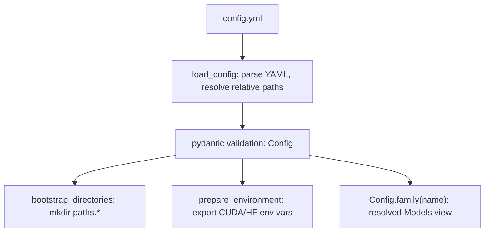

# Configuring a Run

## What it is

`config.yml` is the single source of configuration: paths, the label set,
training hyperparameters, inference knobs, environment variables, and
model families. It is loaded and validated by
`reddit.core.config.load_config` into a frozen, typed
`reddit.core.config.Config` object — nothing downstream mutates it.

## When to use it

Every invocation of the CLI loads a config (`./config.yml` by default, or
`-c/--config <path>`). Edit it to add a model family, change
hyperparameters, point at a different gold dataset, or relocate output
directories.

## Minimal example

```yaml
labels:
  labels:
    down: 0
    neutral: 1
    up: 2
  encodings:
    down: -1
    neutral: 0
    up: 1

families:
  my_family:
    models:
      - {name: qwen2.5_0.5b, id: Qwen/Qwen2.5-0.5B}
    finetuning_methods: [qdora]
```

```bash
reddit train --family my_family --gpu 0
```

`labels.labels` fixes the classification-head ids; `labels.encodings` fixes
the signed trend value (`-1`/`0`/`1`) attached to every labelled row — this
is the directional UP/DOWN/NEUTRAL scheme the paper studies, not a generic
sentiment score.

## Embedded usage

```python
from reddit.core.config import load_config
from reddit.core.environment import bootstrap_directories, prepare_environment

config = load_config("config.yml")
bootstrap_directories(config)
prepare_environment(config, gpu="0")

models = config.family("bert")  # resolved Models view for one family
```

`Config.family(name)` resolves a `families:` entry against the top-level
`training.finetuning_methods` default, raising
`reddit.core.errors.UnknownFamilyError` for an undeclared name.

## Key sections

- **`paths:`** — every project directory; created automatically by
  `reddit.core.environment.bootstrap_directories`.
- **`dataset:`** — the gold Excel file and its text/label columns (see
  [Preparing the Gold Dataset](preparing-the-gold-dataset.md)).
- **`training:`** — shared and per-kind (`bert:`) hyperparameters, seeds,
  and default `finetuning_methods`.
- **`inference:`** — batch size and submissions/comments toggles for corpus
  labelling.
- **`environment:`** — `HF_HOME`, dotenv path, `PYTORCH_CUDA_ALLOC_CONF`.
- **`families:`** — named groups of models, each with an optional
  `kind: bert` (default `llm`) and an optional `finetuning_methods`
  override.

## Flow



## See also

- [Advanced — Implementation Design: Interfaces](../advanced/implementation_design/interfaces.md)
  for the full configuration schema.
- API reference: `reddit.core.config`, `reddit.core.environment`.
