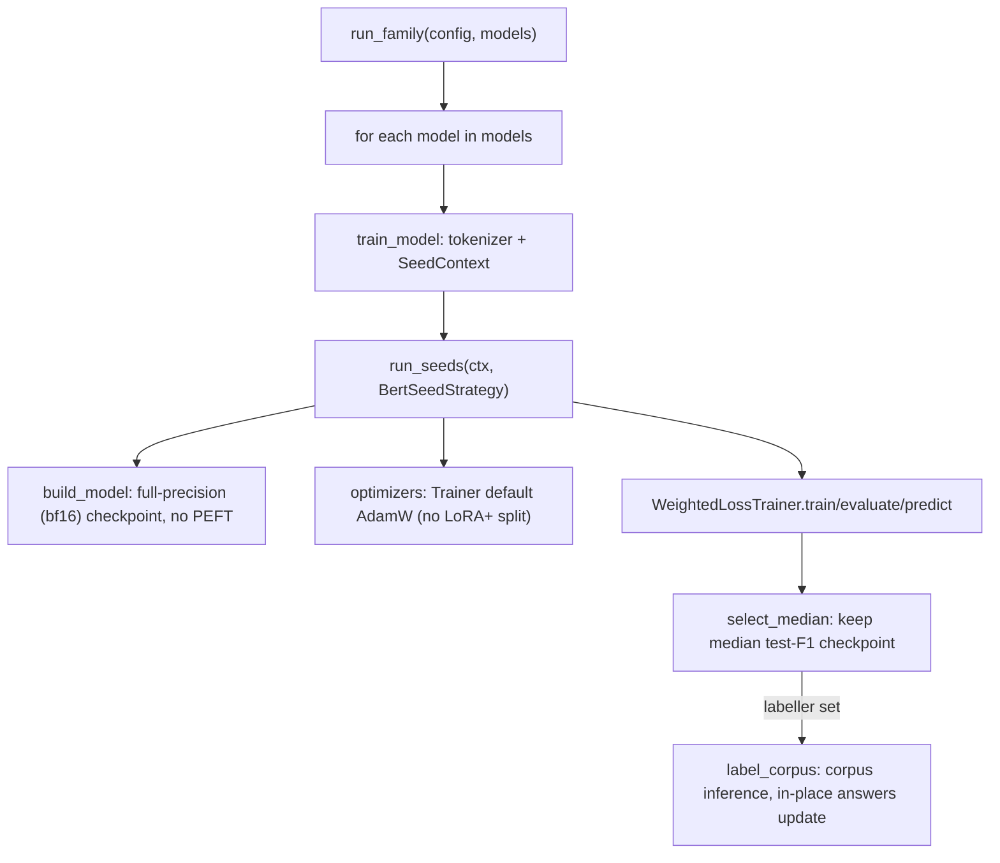

# Fine-Tuning BERT Encoders

## What it is

Multi-seed **full** fine-tuning (no PEFT, no quantization) of BERT-family
encoder classifiers — BERT base, FinBERT, InflaBERT in `config.yml`.
Implemented by `reddit.training.bert.BertSeedStrategy`, driven by the same
shared loop (`reddit.training.loop.run_seeds`) as the decoder-LLM path.

## When to use it

Whenever you add or retrain an encoder family (`kind: bert` in
`config.yml`). This path trains every parameter of the encoder, unlike the
quantized/PEFT decoder-LLM path — see [Fine-Tuning Decoder
LLMs](fine-tuning-decoder-llms.md).

## Minimal example

```bash
reddit train --family bert --gpu 0
```

Fully fine-tunes `bert_base`, `inflabert` and `finbert` over every
configured seed, keeping the median-performing (by test weighted F1)
checkpoint per model.

## Embedded usage

```python
from reddit.core.config import load_config
from reddit.training.bert import run_family

config = load_config("config.yml")
models = config.family("bert")
selected = run_family(config, models, labeller=None, limit=1)
```

Pass `labeller=reddit.inference.bert.label_corpus` to also label the
corpus with each selected checkpoint.

## Flow



## See also

- [Advanced — Operations: Workflows](../advanced/operations/workflows.md#training-bert)
  for the detailed call-chain walkthrough.
- API reference: `reddit.training.bert`, `reddit.modeling.loading`,
  `reddit.training.loop`.
