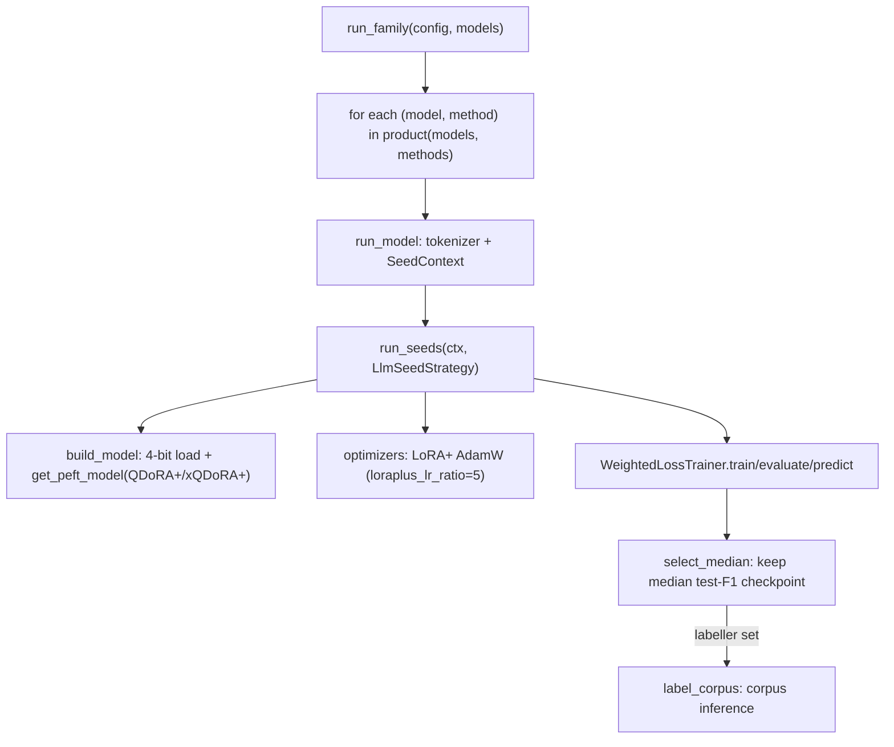

# Fine-Tuning Decoder LLMs

## What it is

Multi-seed PEFT fine-tuning of quantized decoder LLM (SLM) classifiers —
Gemma-2, Llama-3 and Qwen2.5 in `config.yml` — using the paper's two
recipes: **QDoRA+** (4-bit NF4 quantization + DoRA adapters + LoRA+
asymmetric-learning-rate optimizer, rank `r=32`) and **xQDoRA+** (the same
recipe at rank `r=4`, an 8x/2³ reduction in trainable adapter parameters).
Implemented by `reddit.training.llms.LlmSeedStrategy`, driven by the shared
loop in `reddit.training.loop.run_seeds`.

## When to use it

Whenever you add or retrain an LLM family in `config.yml` (`kind: llm`, the
default). Not for BERT-family encoders — see [Fine-Tuning BERT
Encoders](fine-tuning-bert-encoders.md).

## Minimal example

```bash
reddit train --model gemma2_27b --gpu 0
```

Fine-tunes `gemma2_27b` with both `qdora` and `xqdora` (the `gemma`
family's default methods) over every seed in `config.training.seeds`, then
keeps only the median-performing (by test weighted F1) checkpoint per
method. `--model` picks the one model out of its family without touching
its siblings; `--family gemma` would run all of `gemma`'s models instead.

### Several models across GPUs

`scripts/train_queue.sh` trains a cohort as a memory-aware queue. It runs
one `reddit train` per model, never the two methods of one model side by
side, because they share a Hugging Face cache that the last one to finish
deletes. Models go largest measured GPU footprint first, each to the card
with the most memory budget left, and smaller ones fill the gaps as jobs
exit. Once every job has exited, one `reddit upload` publishes the selected
checkpoints.

```bash
DRY=1 bash scripts/train_queue.sh                                      # print the first wave, launch nothing
JOBS="qwen2.5_1.5b:33 qwen2.5_0.5b:17" UPLOAD=0 bash scripts/train_queue.sh
```

`JOBS` lists `<model>:<footprint GB>`; the default is the sub-3B cohort
with the peaks measured on two A100 80GB cards (batch 64 × 1024 tokens,
bf16), so measure again before queueing other models or hardware.
`BUDGET_GB` (default 78) is the per-card budget, `GPUS` the cards to use,
`COMMAND=run` also labels the corpus.

## Embedded usage

```python
from reddit.core.config import load_config
from reddit.training.llms import run_family

config = load_config("config.yml")
models = config.resolve_models(["gemma2_27b"])[0]
selected = run_family(config, models, labeller=None, limit=1)  # train-only, 1 seed
```

Pass `labeller=reddit.inference.llms.label_corpus` to also label the
corpus with each selected checkpoint (this is what `reddit run` does).

## Flow



## See also

- [Advanced — Operations: Workflows](../advanced/operations/workflows.md#training-llms)
  for the detailed call-chain walkthrough.
- API reference: `reddit.training.llms`, `reddit.modeling.peft`,
  `reddit.modeling.loading`, `reddit.training.loop`.
