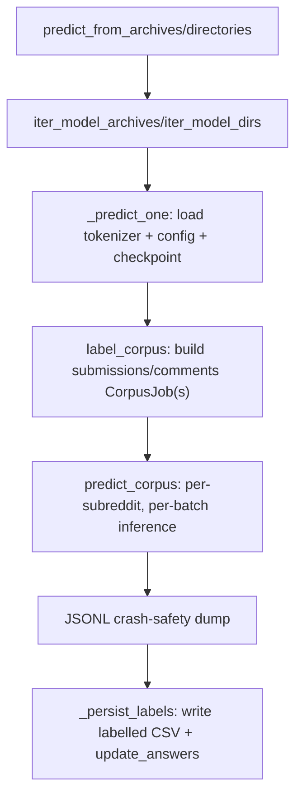

# Labelling the Corpus

## What it is

Batched inference over the full, already-filtered per-subreddit corpus
(r/economy, r/Economics, r/wallstreetbets submissions and comments),
assigning each row a directional label (`down`/`neutral`/`up`) and its
signed trend encoding (`-1`/`0`/`1`). Shared machinery lives in
`reddit.inference.corpus`; kind-specific job builders live in
`reddit.inference.llms` and `reddit.inference.bert`.

**Scope note:** this capability assumes the per-subreddit CSVs already
exist, already keyword-filtered, geo-classified and (for comments)
timeliness-restricted per the paper's methodology. This package does not
construct those CSVs — see [System
Overview](../advanced/implementation_design/system_overview.md#scope-boundary).

## When to use it

After training (`reddit run`, which chains it automatically) or standalone
against previously trained checkpoints (`reddit predict`).

## Minimal example

```bash
reddit predict --family bert --directory models --gpu 0
```

Scans `models/` for `{model}_{seed}` checkpoint directories belonging to
the `bert` family, labels every configured subreddit's submissions and
comments with each, and merges the results into
`results/all_final_jae.csv` / `results/all_comments_final_jae.csv` in
place.

```bash
reddit predict --family gemma --directory models --gpu 0
```

Does the same for `{model}_{method}_{seed}.zip` archives, writing to a
per-family copy of the answers file
(`results/all_final_jae_gemma.csv`) instead of updating it in place.

## Embedded usage

```python
from reddit.core.config import load_config
from reddit.inference.llms import predict_from_archives

config = load_config("config.yml")
models = config.family("gemma")
n = predict_from_archives(config, models, directory="models")
```

## Flow



## See also

- [Advanced — Operations: Downstreams](../advanced/operations/downstreams.md)
  for what the labelled output feeds into (and what it does not, in this
  repository).
- [Advanced — Implementation Design: Data Model](../advanced/implementation_design/data_model.md)
  for the exact corpus/answers CSV schemas.
- API reference: `reddit.inference.corpus`, `reddit.inference.llms`,
  `reddit.inference.bert`, `reddit.inference.discovery`.
