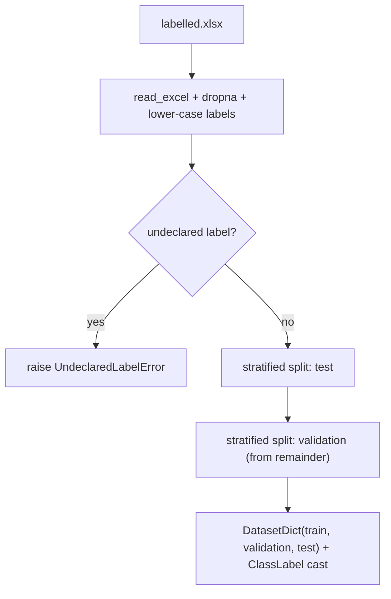

# Preparing the Gold Dataset

## What it is

`reddit.data.preparation.load_and_prepare_data` loads the hand-labelled
seed dataset (`data/labelled.xlsx` by default), cleans it, and produces a
class-stratified train/validation/test split as a Hugging Face
`DatasetDict`. This is the *fine-tuning ground truth*: a small
(~1,400-row, per the paper) dataset of Reddit submission titles annotated
with a directional inflation-expectation label. It is **not** the full
corpus — see [Labelling the Corpus](labelling-the-corpus.md) for that.

## When to use it

Automatically, once per fine-tuning seed, inside
`reddit.training.loop.run_seeds` — you rarely call it directly. Call it
directly if you want to inspect the splits, sanity-check label balance, or
prototype a new model outside the training loop.

## Minimal example

```python
from reddit.core.config import load_config
from reddit.data.preparation import load_and_prepare_data

config = load_config("config.yml")
bundle = load_and_prepare_data(
    data_file_path=config.dataset.path,
    text_column=config.dataset.text_column,
    label_column=config.dataset.label_column,
    test_size=config.dataset.test_size,
    validation_size=config.dataset.validation_size,
    random_seed=107935903,
    labels=config.labels,
)
print(bundle.dataset)          # DatasetDict({train, validation, test})
print(bundle.num_labels)       # 3
print(bundle.id2label)         # {0: "down", 1: "neutral", 2: "up"}
```

Raises `reddit.core.errors.UndeclaredLabelError` if the Excel file contains
a label value not declared under `config.labels.labels`.

## Embedded usage

Any training strategy implementing
`reddit.training.loop.SeedStrategy` receives the resulting
`reddit.data.preparation.DataBundle` as an argument to
`build_model`/`tokenize`; see
[Fine-Tuning Decoder LLMs](fine-tuning-decoder-llms.md) for how
`reddit.training.llms.LlmSeedStrategy` consumes it.

## Flow



## See also

- [Advanced — Implementation Design: Data Model](../advanced/implementation_design/data_model.md)
  for the schema and the label-encoding invariants.
- API reference: `reddit.data.preparation`.
