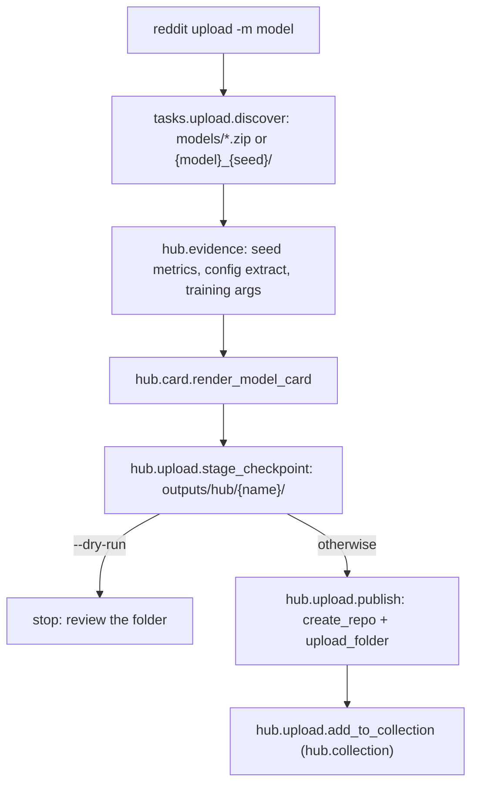

# Publishing to the Hugging Face Hub

## What it is

`reddit upload` turns every selected (median-seed) checkpoint found under
`models/` into one Hugging Face model repository: the adapter or full
weights, the tokenizer, `config.json`, a generated model card, the exact
`TrainingArguments` (`training_args.json`), the extract of `config.yml`
that governed the run (`training_config.yml`) and the per-seed evaluation
tables (`evaluation/`). The repository folder is assembled under
`outputs/hub/{repository name}/` first, so it can be inspected before
anything is pushed.

The published checkpoints live in the
[**Reddit Infla-pulse** collection](https://huggingface.co/collections/andreadm/reddit-infla-pulse)
on the Hub, which `hub.collection` in `config.yml` points at.

## When to use it

After `reddit train`/`run` has selected a checkpoint and you want it on the
Hub. `HubConfig` creates repositories **private** unless told otherwise;
the shipped `config.yml` sets `hub.private: false`, so the cohort is public
like the rest of the collection (pass `--private` to review a checkpoint
first). The generated card is a draft to review — its limitations section
is generic and it does not compute the per-class breakdown of the
hand-written cards.

## Minimal example

```bash
reddit upload --model qwen2.5_0.5b --dry-run    # stage under outputs/hub/, upload nothing
reddit upload --model qwen2.5_0.5b              # create andreadm/reddit-pulse-qwen2.5_0.5b-qdora (+ -xqdora), push, add to the collection
reddit upload --family bert --public            # fully fine-tuned encoders, public repositories
```

Requirements:

- `hub.namespace` in `config.yml` names the user or organisation to upload
  to; `hub.repo_name` is the name template (`{slug}` is `{model}-{method}`,
  or `{model}` for BERT; the default `reddit-pulse-{slug}` follows the
  hand-published `andreadm/reddit-pulse-bert`, e.g. `reddit-pulse-gemma2_2b-xqdora`).
- A token with **write** access in the dotenv as `HF_WRITE_TOKEN`
  (`HF_TOKEN`, the read token training downloads with, is the fallback).
  A read-only token is enough for training but the upload fails at
  repository creation.
- `hub.collection` (a slug, a slug without its id, or the collection URL)
  adds every published repository to that collection, the
  [Reddit Infla-pulse collection](https://huggingface.co/collections/andreadm/reddit-infla-pulse)
  in the shipped config; a failure there is logged after the upload has
  succeeded, not raised.
- Base models with a redistribution license of their own (Llama, Apache
  bases) ship `LICENSE*`/`USE_POLICY*` files: they are fetched from the
  base repository and published alongside the weights, and the card's
  `license` field and License section follow the base model's declared
  license. Gemma keeps its terms on Google's page; the card links them.

## What gets uploaded

| File | Source |
|---|---|
| `adapter_config.json`, `adapter_model.safetensors` (LLM) or `model.safetensors` (BERT) | The selected checkpoint |
| `config.json`, `tokenizer.json`, `tokenizer_config.json`, ... | The selected checkpoint (`config.json` is written by the training loop so the adapter carries its head size, labels and pad token) |
| `README.md` | Generated by `reddit.hub.card.render_model_card` from the metric dumps, `config.yml` and the PEFT recipe; titled `Reddit-pulse <base model> <method>` (`Reddit-pulse Gemma 2 2B QDoRA+`) |
| `training_args.json` | `training_args.bin`, with this box's directory names removed (the pickle itself is not uploaded) |
| `training_config.yml` | Extract of `config.yml`: dataset columns and split sizes, labels, training block, seeds, base model, selected seed |
| `evaluation/seeds_test_metrics.csv`, `evaluation/seeds_validation_metrics.csv` | Every seed's metrics from `outputs/{family}_{date}/dist_{model}_*_metrics.jsonl`, the selected seed flagged |
| `LICENSE*`, `USE_POLICY*` | The base repository's own notices, when it ships any |

The card also reports the label shares over the paper's corpus when the
checkpoint was run over it (`reddit run`/`predict` leave the labelled CSVs
under `labels_dir`), so the section matches the reference card's.

Loading a published adapter follows the card's snippet: the 4-bit base
model first, then `PeftModel.from_pretrained` on top. Handing the
repository name straight to `AutoModelForSequenceClassification` rebuilds
the DoRA adapter with different logits than the trained model, which is
also why `reddit predict` never does that.

## Flow



## See also

- [Fine-Tuning Decoder LLMs](fine-tuning-decoder-llms.md) and
  [Fine-Tuning BERT Encoders](fine-tuning-bert-encoders.md) for how the
  checkpoints being published are selected.
- [Configuring a Run](configuring-a-run.md) for the `hub:` section.
- API reference: `reddit.hub`, `reddit.tasks.upload`.
