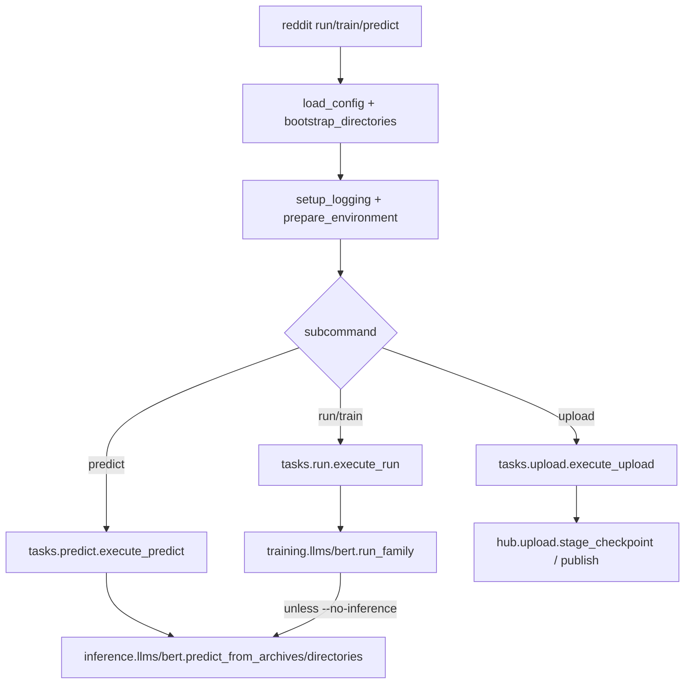

# Using the CLI

## What it is

The `reddit` command (installed as a console script, also reachable via
`python -m reddit`) is the single entry point for training, selecting, and
labelling and publishing. It dispatches to one of four subcommands, all
sharing `-c/--config` and `-g/--gpu`.

## When to use it

Any time you want to fine-tune a model family, or label the corpus with
checkpoints you already trained. For programmatic/embedded use (e.g. from
a notebook or an orchestration script), call the underlying pipeline
functions directly instead — see [Fine-Tuning Decoder
LLMs](fine-tuning-decoder-llms.md) and [Labelling the
Corpus](labelling-the-corpus.md).

## Minimal example

```bash
reddit run --family test --limit 1 --gpu 0
```

Trains the `test` family on one seed, selects it, and labels the corpus.
Exit code `0` on success; see [Quickstart](../getting_started/quickstart.md)
for the full expected output.

## Subcommands

- **`reddit run -f <family>...`** — train every model in the given
  family/families over every configured seed, select the median seed per
  (model, method), then label the corpus (unless `--no-inference`).
- **`reddit train -f <family>...`** — identical to `run`, but always skips
  corpus labelling (equivalent to `run --no-inference`).
- **`reddit predict -f <family>... -d <directory>`** — label the corpus using
  checkpoints already present in `<directory>`, without training anything.
- **`reddit upload -m <model>... [--dry-run] [--private|--public]`** — stage
  the selected checkpoints found in `-d <directory>` (default `models`) as
  Hub repository folders under `outputs/hub/` and, unless `--dry-run`, push
  them to `hub.namespace` (see [Publishing to the Hub](publishing-to-the-hub.md)).

Every subcommand selects which models to act on via one — and only one — of:

- **`-f/--family <name>...`** — one or more families from `families:`.
- **`-m/--model <name>...`** — one or more model names, looked up across
  every declared family. A name declared by more than one family is
  rejected as ambiguous; use `-f` instead in that case.
- **`--all-families`** (alias `--all-models`) — every model in every
  declared family.

## Embedded usage

`reddit.cli.build_parser()` returns a plain `argparse.ArgumentParser`,
reusable if you need to embed the same CLI surface in another tool:

```python
from reddit.cli import build_parser

parser = build_parser()
args = parser.parse_args(["run", "--family", "bert", "--gpu", "0"])
```

For fully programmatic control (no argument parsing at all), call
:func:`reddit.tasks.run.execute_run` / :func:`reddit.tasks.predict.execute_predict` /
:func:`reddit.tasks.upload.execute_upload`
directly with a `Namespace`-like object and a loaded
:class:`reddit.core.config.Config`.

## Flow



The CLI resolves the config, prepares the CUDA/HF environment, then hands
off to the training or inference pipeline; `run` chains both.

## See also

- [Advanced — Operations: Workflows](../advanced/operations/workflows.md)
  for the full call-chain walkthrough of every subcommand.
- API reference: `reddit.cli`, `reddit.tasks`.
